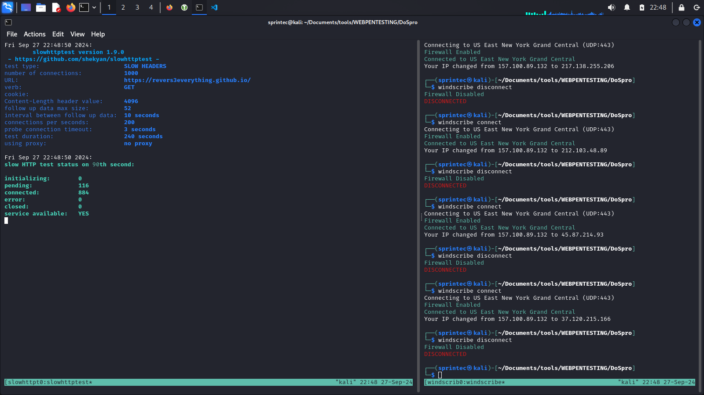

# DoSpro

**DoSpro** is a tool designed to perform a Denial of Service (DoS) attack by dynamically changing the IP address every 10 seconds to bypass Web Application Firewall (WAF) blocks or bans. This tool leverages **Free Windscribe VPN** to cycle through different IP addresses and **slowhttptest** to execute the DoS attack. 


## Disclaimer

This tool is intended for educational purposes only. Unauthorized use of this tool to disrupt services or networks without permission is illegal and unethical. Always ensure you have proper authorization before using such tools.

## Requirements

- **Linux-based operating system** (preferred)
- **tmux** (Terminal multiplexer)
- **slowhttptest** (For executing the DoS attack)
- **Windscribe** (For rotating IP addresses)

## Installation

1. **Install slowhttptest**:
   ```bash
   sudo apt-get install slowhttptest

Install Windscribe VPN: Follow the official installation guide for Windscribe on your system:
Windscribe Linux Installation Guide

2. **Install tmux if you don’t have it installed**:

    ```bash
    sudo apt-get install tmux

3. **Usage**:

    Start Windscribe: Make sure Windscribe is installed and running. Open a new tmux session for Windscribe:
    ```bash
    python3 DoSpro.py



## Attaching to tmux sessions

    To attach to the Windscribe session:

    $tmux attach-session -t windscribe_session

    To attach to the slowhttptest session:

    $tmux attach-session -t slowhttptest_session

